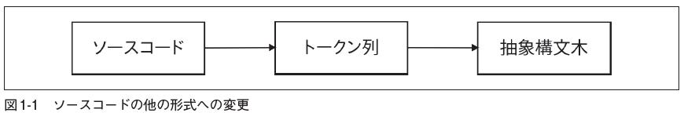

### 1.1 字句解析

まずはソースコードを扱いやすい形式に変換する必要がある。



ソースコードからトークン列の変換を字句解析、トークン列から抽象構造木への変換を構文解析という。

字句解析器への入力が次のようなものだとする。

```let x = 5 + 5;```

字句解析器から次のような物が出てくる。

```
[
LET,
IDENTIFIER("x"),
EQUAL_SIGN,
INTEGER(5),
PLUS_SIGN,
INTEGER(5),
SEMICOLON
]
```

これらのトークンは、全てに元のソースコードを表現したものが結びつく。
LET -> "let"
PLUS _ SIGN = "+"

具体的な値が付いていることもある
INTEGER -> 5
IDENTIFIER -> "x"

トークン列を生成する時点では変換しない実装もありうる。

ホワイトスペースはトークンとして出てこない。

Pythonのような言語であれば、ホワイトスペースの数は重要でホワイトスペースをトークンとして出力する必要がある。

###　1.2　 トークンを定義する

```
let five = 5;
let ten = 10;
let add = fn(x, y) {
x + y;
};
let result = add(five, ten);
```

このコードの字句解析について考えていく。

数は5でも10でも区別せず単に数であることがわかればいい。
「変数名」にも同じことが当てはまる。これらを「識別子」と呼ぶ。

識別子のように見えて識別子ではなく、実際には言語の一部である単語を「キーワード」と呼ぶ。これらは整数や識別子のようにまとめて扱うことはしない。

次にデータ構造を定義する。

「タイプ（type）」属性、　トークンのリテラル値を保持するフィールド

新しいtokenパッケージにToken構造体とTokenType型を定義するとこうなる。

Token構造体
```go
package token
type TokenType string
type Token struct {
    Type TokenType
    Literal string
}
```

TokenType型

```go
const (
    ILLEGAL = "ILLEGAL"
    EOF = "EOF"
    // 識別子 + リテラル
    IDENT = "IDENT" // add, foobar, x, y, ...
    INT = "INT" // 1343456
    // 演算子
    ASSIGN = "="
    PLUS = "+"
    // デリミタ
    COMMA = ","
    SEMICOLON = ";"
    LPAREN = "("
    RPAREN = ")"
    LBRACE = "{"
    RBRACE = "}"
    // キーワード
    FUNCTION = "FUNCTION"
    LET = "LET"
)
```

ILLEGALとEOFがあえて追加されている。

ILLEGALはトークンや文字が未知であることを表す。
EOFはファイル終端（end of file）を
表す。

### 1.3　 字句解析器（レキサー）

字句解析を作っていく。
字句解析器は、ソースコードを入力として受け取り、出力としてそのソースコードを表現するトークン列を返す。
