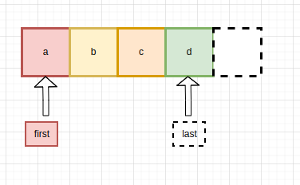
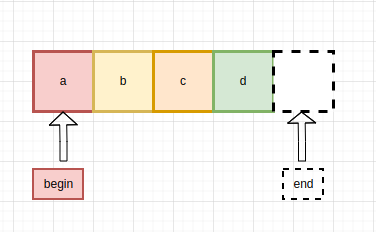

# 誤解されない名前

#### カギとなる考え
名前が「他の意味と間違えられることはないだろうか？」と何度も自問自答する。

----------------------------

## 情報を詰め込んだ名前の付け方
- [誤解されない名前](#誤解されない名前)
      - [カギとなる考え](#カギとなる考え)
  - [情報を詰め込んだ名前の付け方](#情報を詰め込んだ名前の付け方)
    - [例:filter()](#例filter)
    - [例:Clip(text,length)](#例cliptextlength)
    - [限界値を含めるときはminとmaxを使う](#限界値を含めるときはminとmaxを使う)
    - [包含/排他的範囲にはbeginとendを使う](#包含排他的範囲にはbeginとendを使う)
    - [ブール値の名前](#ブール値の名前)
_________________________

### 例:filter()

filterだけでは選択するのか除外するのかがわからない
選択する -> select
除外する -> excute
にするとわかりやすい

### 例:Clip(text,length)

段落の内容を切り抜くことを考える

CLipの動作
- 最後からlength文字を削除する(remove)
- 最大length文字まで切り詰める(truncate)
  
lengthの解釈
- バイト数
- 文字数
- 単語数

length -> max_chars

### 限界値を含めるときはminとmaxを使う

ショッピングカートに商品が10点しか入らないときを考える
CART_TOO_BIG_LIMITはあいまいな表現
未満なのか以上なのかがわからない
CART_TOO_BIG_LIMIT  ->  MAX_ITEMS_IN_CART

* アドバイス
  限界値を明確にするには、名前にmax_やmin_をつける

### 範囲を指定するときはfirstとlastを使う

```python
print integer_range(start=2, stop=4)
```
stopは複数の意味に解釈できる。firstとlastを使うのがいい。
またはmin, maxを使って包含的範囲を表すこともできる。

```python
set.Printkeys(first="Bart",last="Maggie")
```

### 包含/排他的範囲にはbeginとendを使う

10月16日に開催されたイベントを印字したいとき
```java
PrintEventsInRange("OCT 16 12:00am", "OCT 17 12:00am") // 良い
```
```java
PrintEventsInRange("OCT 16 12:00am", "OCT 16 11:59:59.999pm") // 悪い
```
この場合の引数はどうすると良いのか。
プログラムの命名規則では包含/排他的範囲にはbeginとendを使うことが多い。

### ブール値の名前

ブール値の変数やブール値を返す関数の名前を選ぶときには, trueとfalseの意味を明確にしなければいけない。

危険な例:
```c
bool read_password = true;
```
2つの解釈がある
* パスワードをこれから読み取る必要がある
* パスワードをすでに読み取っている

この場合はreadを避けると良い。
need_password
user_is_authenticated

頭にis,has,can,shouldをつけるとわかりやすくなる

名前を否定形にはしない

### ユーザーの期待に合わせる

例: get*()

多くのプログラマはgetで始まるメソッドはメンバの値を返すだけの「軽量アクセサ」であるという規約に慣れしたしんでいる。

やってはいけない例：
```java
public class StatisticsCollector{
    public void addSample(double x){
        .....
    }
    public double getMain(){
        // すべてのサンプルをイテレートして、total/num_sampleを返す。
    }
}
```
getMean()はコストがとても高い。そのためこのことがわかるようにcomputeMean()などの名前に変えるべきだ。

例:lit::size()

```c++
void ShrinkList(list<Node>& list, int max_size){
    while (list.size() > max_size){
        FreeNode(list.back());
        list.pop_back();
    }
}
```
このコードは技術的には正しいし、ユニットテストも成功するがバグがある。時間がかかりすぎるのだ。
list.size()の計算量がO(n)であるため、ShrinkList()の計算量がO(n^2)になってしまっている。

C++にはほかにもコンテナがあるがどれも一定時間で終了するsize()メソッドを持っている。size()という名前がcountSize()やcountElemrnts()だったらこのような問題は起きなかった。

### 複数の名前を検討する

複数の候補を検討し、誤解が少ない名前を選択しよう。
